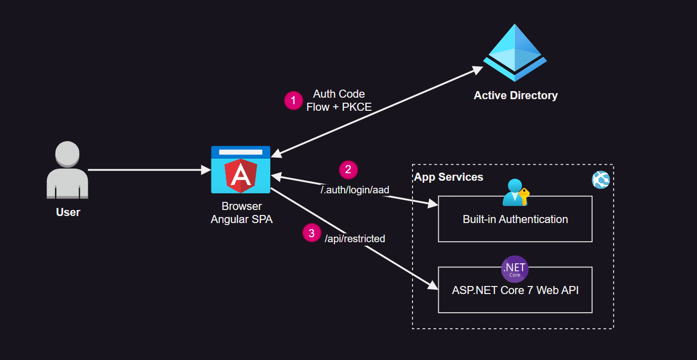
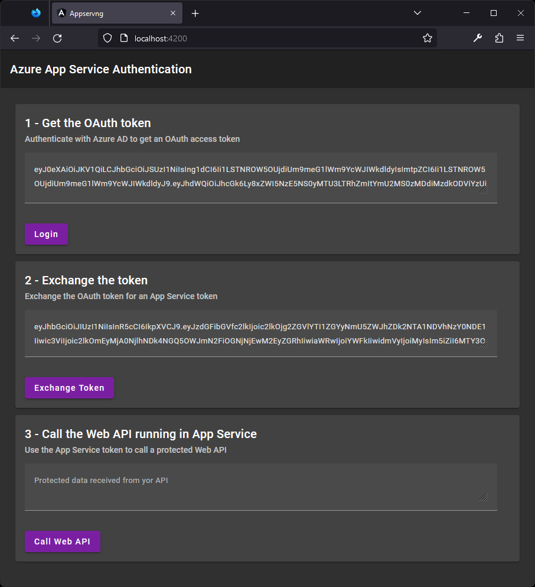

# Azure App Service custom sign-in

Implementation of [Customized sign-in/sign-out](https://learn.microsoft.com/en-us/azure/app-service/configure-authentication-customize-sign-in-out) using App Service Authentication.



Interface that executes the authentication flow:



## 1 - Create the infrastructure

Create the App Service resorces:

```sh
az group create -n rgapp -l eastus
az appservice plan create -g rgapp -n planapp --is-linux --sku B1
az webapp create -g rgapp -p planapp -n appcustomsignin789 -r "DOTNETCORE:7.0" --https-only
az webapp config set -g rgapp -n appcustomsignin789 --always-on true
```

Add the required app settings (environment variables):

```sh
az webapp config appsettings set -g rgapp -n appcustomsignin789 \
        --settings WEBSITE_RUN_FROM_PACKAGE=1
```

Set up CORS:

```sh
az webapp cors add -g rgapp -n appcustomsignin789 --allowed-origins "*"
```

Restart the app:

```sh
az webapp restart -g rgapp -n appcustomsignin789
```

## 2 - Add Authentication to App Services

Using the Portal, add an identity provider:

- Identity Provider: Microsoft
- App Registration Type: Create new
- Supported account types: Current / Single tenant
- Restrict access: Require
- Unauthenticated requests: HTTP 401
- Token store: No (Uncheck the box)

➡️ Open the configuration and **change the Issuer URL** to the updated one:

- Issuer URL: `https://login.microsoftonline.com/{TENANT_ID}`

Make sure the token audiences is configured:

- Allowed token audiences: `api://{APPLICATION_ID}`

## 3 - Update the App Registration

Delete the Web App platform.

Create a new SPA platform with redirect URI `http://localhost:4200`.

Do not select any token generation for the Authentication endpoint. This will trigger the app registration to use Auth Code Flow + PKCE.

## 4 - Deploy the Web API to Azure

Enter the application directory:

```sh
cd webapi
```

Build and deploy the webapi to App Services:

```sh
bash build.sh
az webapp deployment source config-zip -g rgapp -n appcustomsignin789 --src ./bin/webapi.zip
```

## 5 - Call the APIs

To run the Angular client locally, create the `angular\src\environments\environment.development.ts` file:

```ts
export const environment = {
  production: false,
  APPSERV_ENDPOINT_URL: "https://appcustomsignin789.azurewebsites.net",
  AZUREAD_CLIENT_ID: "{APPLICATION_ID}",
  AZUREAD_TENANT_ID: "{TENANT_ID}"
};
```

Start the Angular app:

```sh
ng serve
```

The website should be available at http://localhost:4200

---

Destroy the Azure resources to avoid costs.
